# namer_app_sely

## My First Flutter App

## 1. Create a new project 
Pada kali ini saya memberi nama project flutter saya dengan nama 'namer_app_sely'

### Configure on pubspec.yaml and analysis_options.yaml
pubspec.yaml
```
name: namer_app_sely
description: A new Flutter project.

publish_to: 'none' # Remove this line if you wish to publish to pub.dev

version: 0.0.1+1

environment:
  sdk: '>=2.19.4 <4.0.0'

dependencies:
  flutter:
    sdk: flutter

  english_words: ^4.0.0
  provider: ^6.0.0

dev_dependencies:
  flutter_test:
    sdk: flutter

  flutter_lints: ^2.0.0

flutter:
  uses-material-design: true
```
analysis_options.yaml
```
include: package:flutter_lints/flutter.yaml

linter:
  rules:
    prefer_const_constructors: false
    prefer_final_fields: false
    use_key_in_widget_constructors: false
    prefer_const_literals_to_create_immutables: false
    prefer_const_constructors_in_immutables: false
    avoid_print: false
```
### Configure on main.dart
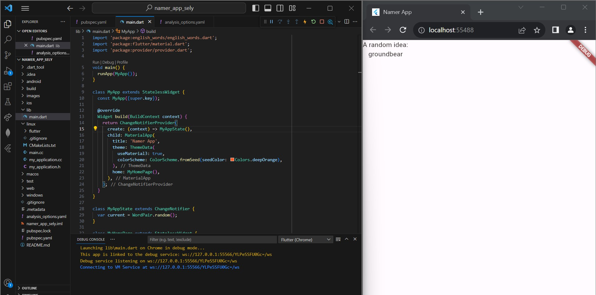

### First Hot Reload
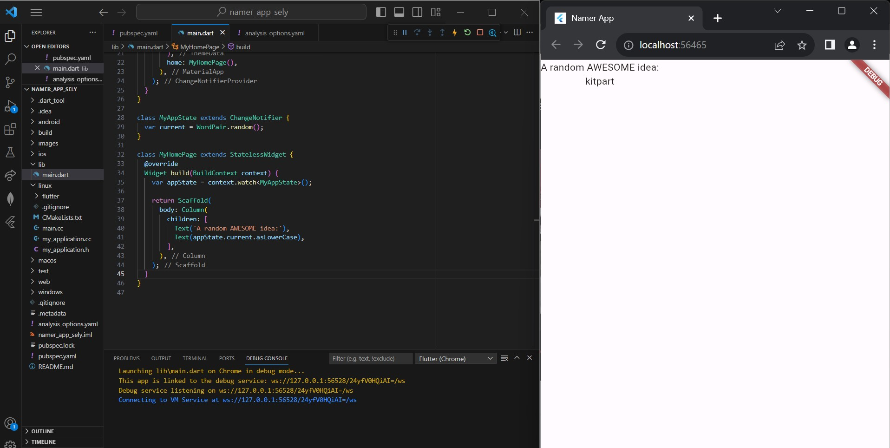

## 2. Adding a button
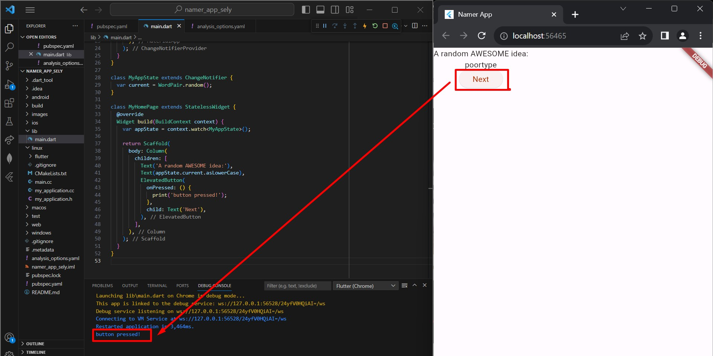

## 3. Make the app prettier
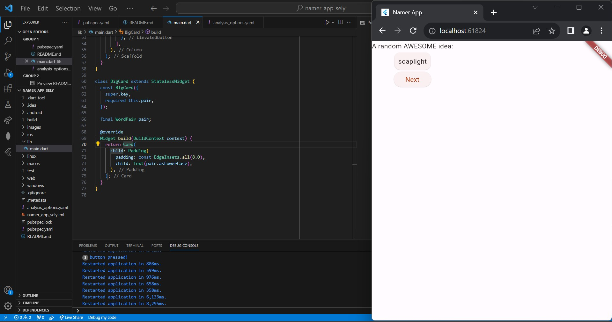

### Theme and style
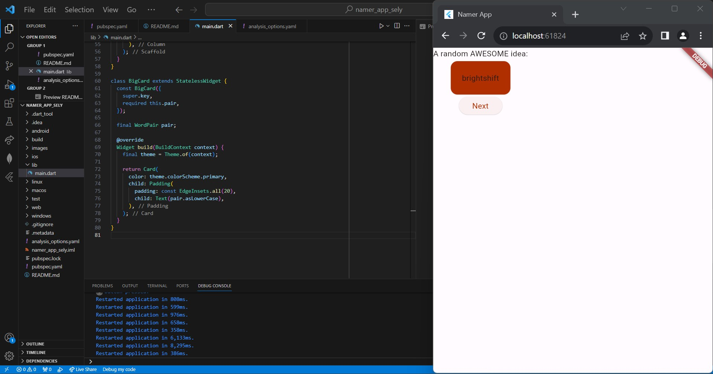

### TextTheme
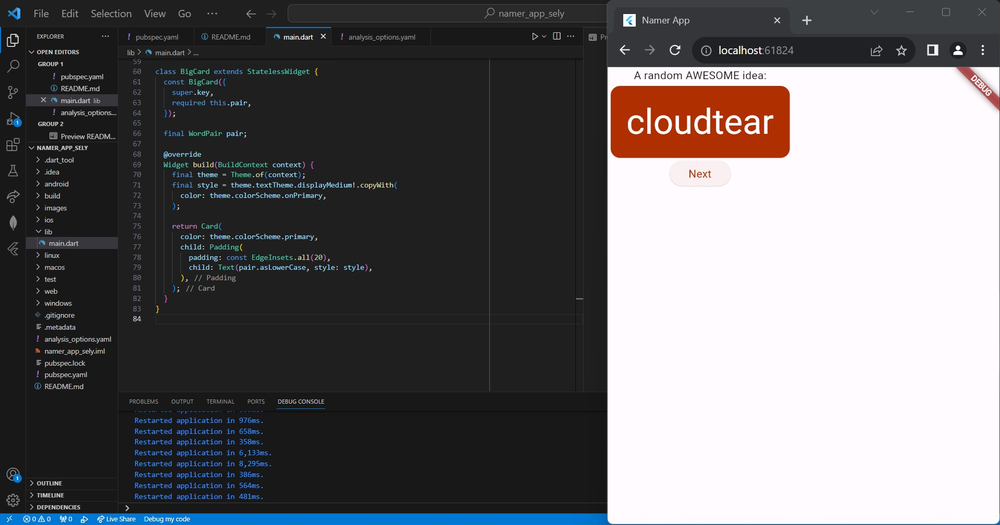

### Center the UI
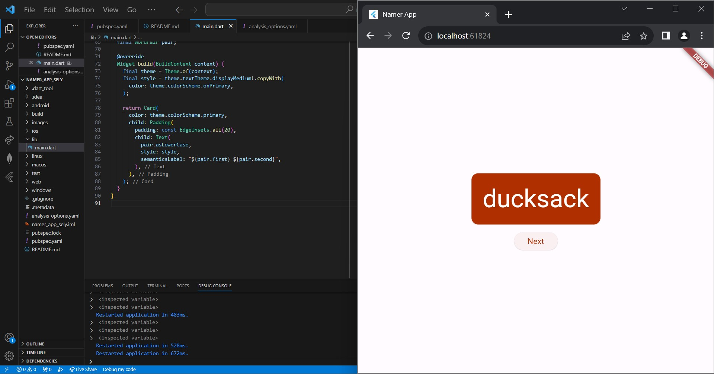

## 4. Add functionallity
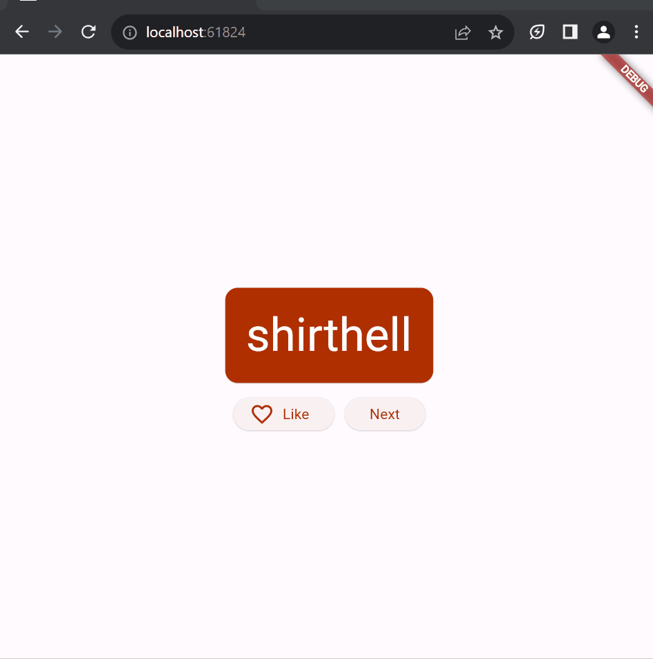

## 5. Add navigation rail
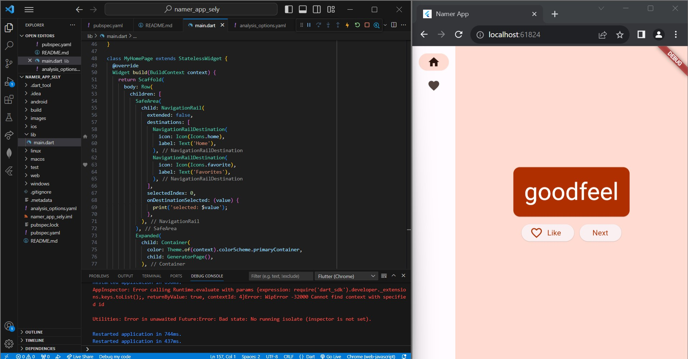

### Expanded area
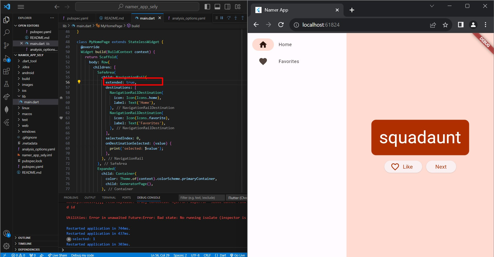

### Statefull widgets


### Use selectedIndex
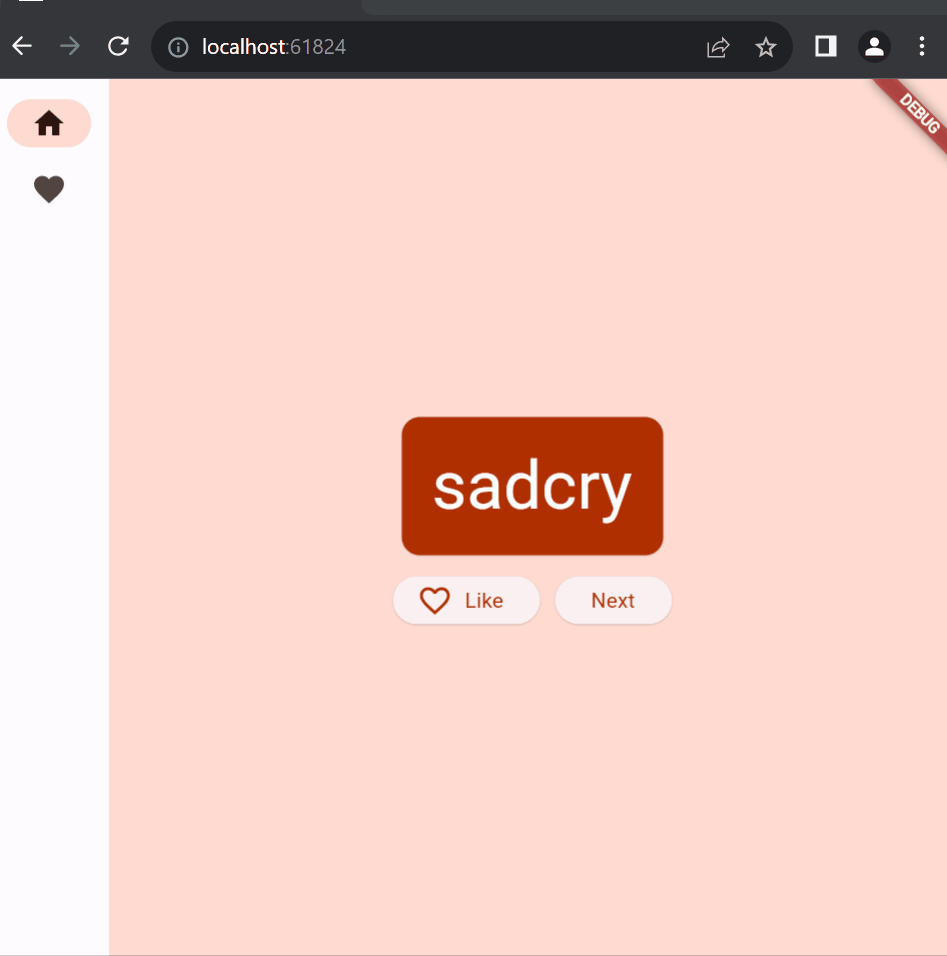

### Responsiveness
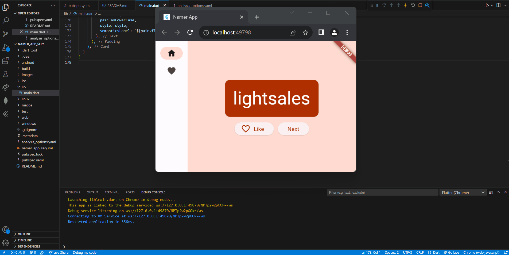

## 6. Add a new page
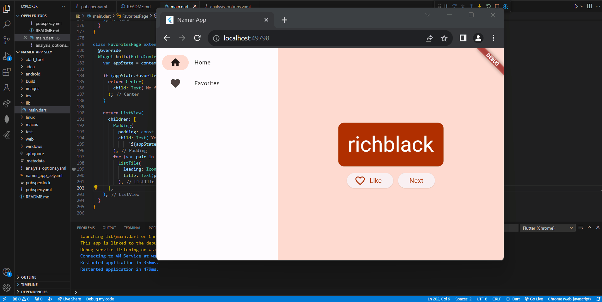

## 7. Next steps
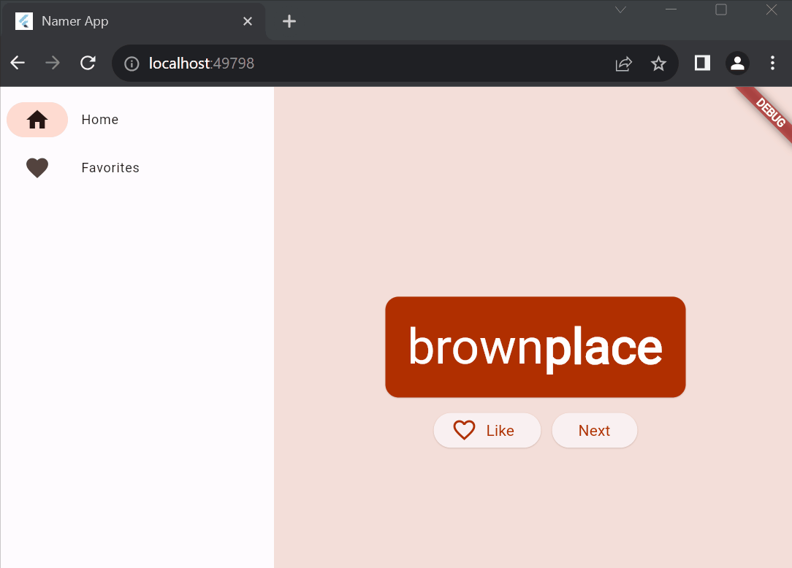
